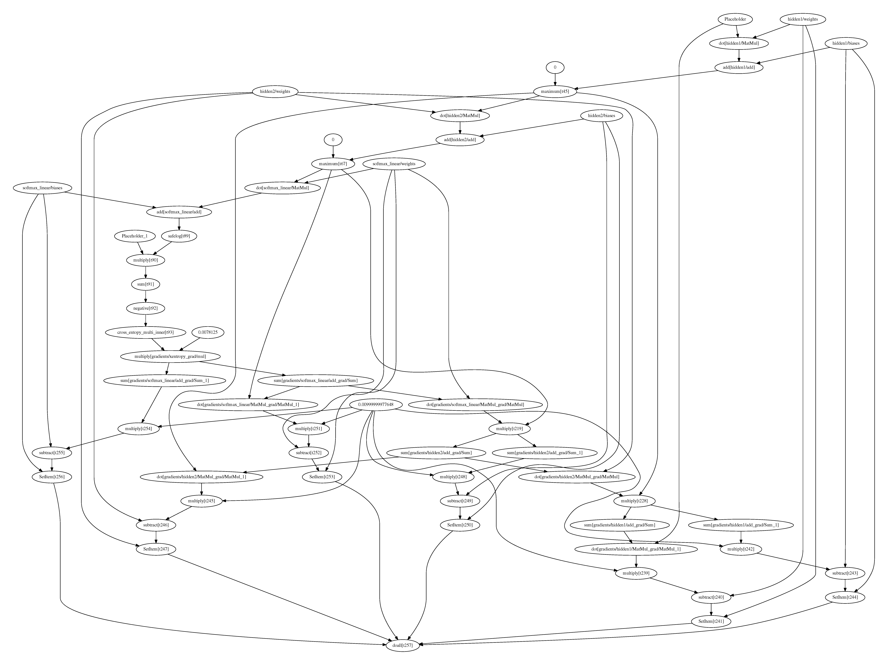

# Run TF's Graph with Neon

## Setup

Tensorflow is currently installed as part of ununoctium:

```
cd ununoctium
make install
```

## Things to be done with TF

### 1. Save TF's dataflow and weights

TensorFlow provides an [example](https://github.com/tensorflow/tensorflow/tree/master/tensorflow/examples/tutorials/mnist) of training a simple MLP on the MNIST dataset. We made a new copy and modified the training script, adding code for graph/variable exportation.


#### 1.1 Computation graph

To save the GradDef as protobuf, add the following code at the end of the training.

```  
graph_pbtxt = "mnist_mlp_graph.pb.txt"  
graph_pb = "mnist_mlp_graph.pb"  

tf.train.write_graph(sess.graph_def, "./", graph_pbtxt, True) # text protobuf  
tf.train.write_graph(sess.graph_def, "./", graph_pb, False) # binary protobuf
```

The compuation graph is saved in .pb.txt file and its binary version is saved in the .pb file.

#### 1.2 Variables  

To save the variable values, add following code at the beginning of the training

```
saver = tf.train.Saver() 
```

and the following code at the end of training.

```  
checkpoint = "mnist_mlp_model.ckpt"  
saver.save(sess, checkpoint)
```

The variable values are saved in the **checkpoint** (.ckpt) file.

#### 1.3 MetaGraph

Note that TensorFlow also saves a [MetaGraph](https://www.tensorflow.org/versions/r0.9/how_tos/meta_graph/index.html) (.meta) file, which contans MetaInfoDef, GraphDef, SaverDef and CollectionDef. 
[Here](http://stackoverflow.com/questions/36195454/what-is-the-tensorflow-checkpoint-meta-file#) is an explanition about MetaGraph.

### 2 Training

To run the training script, first activate the virtual environment, for example:

```
$ source ~/code/private-neon/.venv/bin/activate
```

Then execute the stript `tf_benchmark/mnist/fully_connected_feed.py`

```
(tensorflow)$ cd tf_benchmark/mnist/
(tensorflow)$ python fully_connected_feed.py
```
### 3. Visualize the graph and find the last node

Now we can visualize the graph with TensorBoard.

```
$ tensorboard --logdir=. & firefox http://0.0.0.0:6006
```
We can identify the last operation used for inference is `softmax_linear/add`. 
The inference graph includes all operators that leads to this op.

## Run TF's Inference Graph with Neon

### 1. Combine the graph and checkpoint

For inference only application, we need to load two files: the model's computation graph (.pb.txt) and its weights (.ckpt). 
However, for some applications, loading one file is more convenient.
In addition, the model parameters (variables) would not change any more and can be converted to constant values. 

TensorFlow provides a convenient tool [freeze_graph](https://github.com/tensorflow/tensorflow/blob/master/tensorflow/python/tools/freeze_graph.py) to combine the computation graph and the checkpoint file into a single file, in which the variables are converted to constant values. An example of freezing a trained mnist graph is as follows:

```
(.venv)$ python freeze_graph.py \
  --input_graph=mnist_mlp_graph.pb.txt \
  --input_checkpoint=mnist_mlp_model.ckpt \
  --output_graph=mnist_mlp_graph_froze.pb \
  --output_node_names=softmax_linear/add
```
We provide bash script inside each example folder for convenience. So simply call `freeze_graph.sh` inside each folder should work.

Note that the `--output_node_names` option is the name of the last operation for inference, which is currently manually identified in the `mnist_mlp_graph.pb.txt` file. 

### 2. Execute the frozen graph with Neon's graph backend

Switch to the virtual environment to Neon:

```
$ source ~/code/private-neon/.venv/bin/activate
```

Executing the following command will convert the frozen graph into Neon's graph and execute it.

```
(.venv)$ python inference_mnist_mlp.py --pb_file='mnist/mnist_mlp_graph_froze.pb'
``` 

The computation graph is as follows:


## Training a TF Model with Neon

We can also train the model from scratch with Neon's graph backend.

```
(.venv)$ python train_mnist_mlp.py --pb_file='mnist/mnist_mlp_graph.pb'
```

The protobuf file `mnist_mlp_graph.pb` contains separate graphs for variable initialization, variable update (fprop/bprop) and serilization.

The assembled frop/bprop graph can be visualized as follows:
